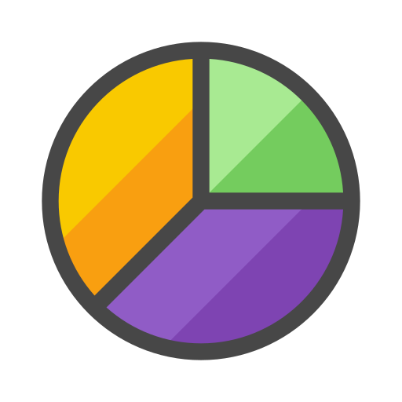
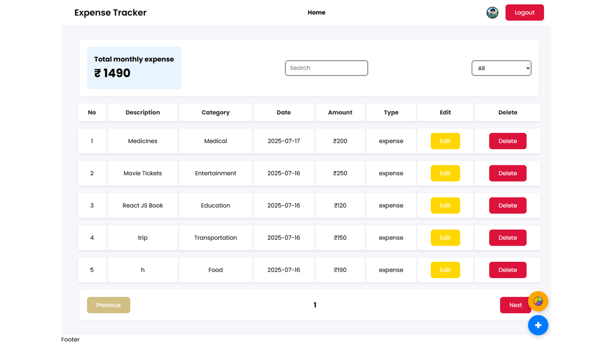
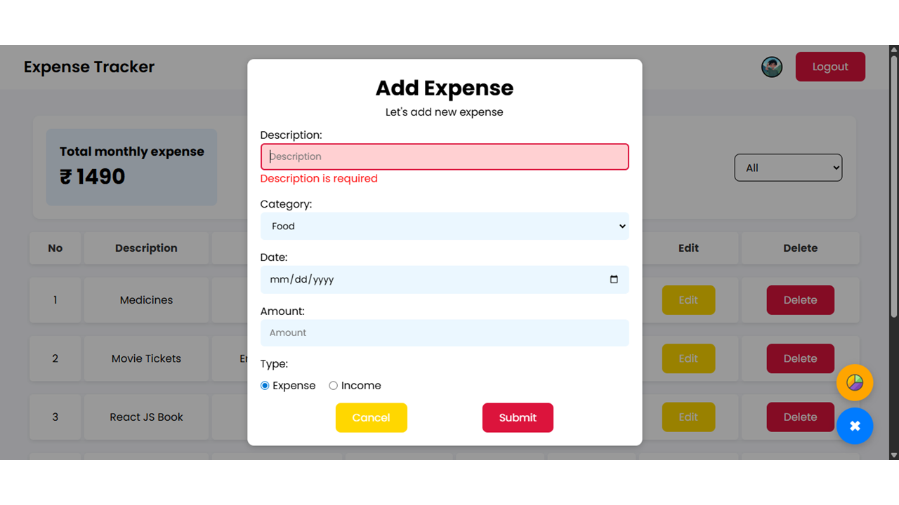
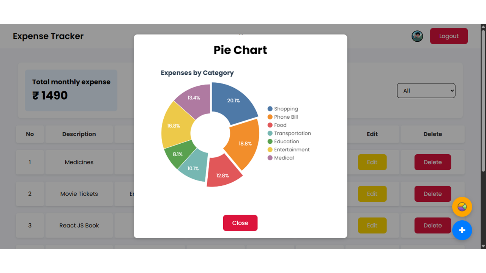

<!-- Banner -->
<p align="center">
  
</p>

<!-- Social Links -->
<p align="center">
  <a href="https://bhatujay.github.io"></a>
  <a href="https://github.com/BhatuJay"></a>
  <a href="https://linkedin.com/in/jaybhatu"></a>
  <a href="https://x.com/AhirBhatuJay"></a>
  <a href="https://instagram.com/jay_bhatu_2135"></a>
  <a href="https://youtube.com/@bhatujay"></a>
</p>

---

## 🚀 Live Demo  

<p align="center">
  <a href="https://react-expense-tracker-delta-puce.vercel.app" target="_blank">
    
  </a>
</p>

<p align="center">
  👉 <a href="https://react-expense-tracker-delta-puce.vercel.app" target="_blank">Click here or LOGO to try Expense Tracker</a>
</p>

---

## 🌟 Project Preview

<p align="center">
  
<!--    -->
<!--    -->
<!--    -->
</p>

---

## ✨ Features

- 🔐 User authentication (via MockAPI `users` endpoint)  
- ➕ Add, ✏️ edit, and ❌ delete expenses (via MockAPI `expenses` endpoint)  
- 🔍 Search and filter expenses by category/date  
- 📊 Expense summary with **pie chart** visualization  
- 💾 Login Data with **LocalStorage**  
- 🧹 Clean modular React components  

---

## 🛠 Tech Stack

<p align="center">
  
</p>

- **React** – UI components & state management  
- **MockAPI** – Remote database for users & expenses  
- **LocalStorage** – Login Data
- **Chart.js / Recharts** – Expense visualization  
- **CSS** – Clean responsive styling  

---

## ⚡ Getting Started

```bash
# Clone the repo
git clone https://github.com/BhatuJay/react-expense-tracker.git
cd react-expense-tracker

# Install dependencies
npm install

# Run dev server
npm start

# Build for production
npm run build
